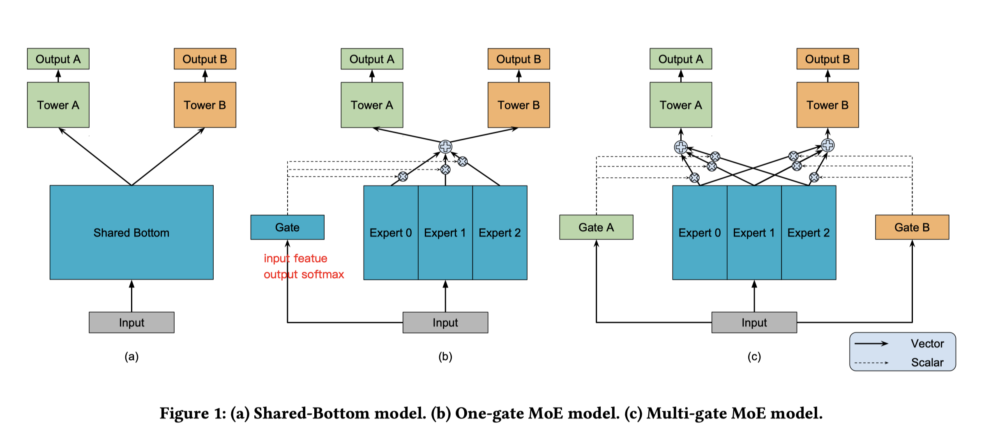

>本篇论文提出的MMoE方法，用于多任务的学习，思想比较简单，看下面的图就知道了。主要解决的问题就是，在多任务学习过程中，我们希望共享权重，以减少模型体积，并且实现端到端的训练，但是，在训练的过程中 不同的task间会有相互影响，任务的相关性对于模型的学习非常的敏感，那么是不是可以减少这种不同任务之间的相互干扰，同时实现端到端的训练呢？本文就是一种平衡的方法

<!-- more -->

---

作者：Jiaqi Ma

论文链接：[https://dl.acm.org/doi/pdf/10.1145/3219819.3220007](https://dl.acm.org/doi/pdf/10.1145/3219819.3220007)

代码：[https://github.com/easezyc/Multitask-Recommendation-Library/blob/main/models/mmoe.py](https://github.com/easezyc/Multitask-Recommendation-Library/blob/main/models/mmoe.py)

---





解释一下：

- Expert就是基础网络，啥网络都可以，共享
- Gate 就是控制门，可训练参数，输出softmax，softmax对应N个Expert
- Tower A 和 Tower B 就是独立的任务分枝。

应用：

这是推荐任务的论文，在CV中，可以从layer4 拉出来分支，然后使用gate，只要gate是可训练参数，维度匹配上，就可以进行训练了。


伪代码：

```python

# init 网络
# expert 是一个modulelist
self.expert=torch.nn.ModuleList([MultiLayerPerceptron(self.embed_output_dim, bottom_mlp_dims, dropout, output_layer=False) for i in range(expert_num)])

# tower是一个modulelist
self.tower=torch.nn.ModuleList([MultiLayerPerceptron(bottom_mlp_dims[-1], tower_mlp_dims, dropout) for i in range(task_num)])

# gate是一个modulelist
self.gate=torch.nn.ModuleList([torch.nn.Sequential(torch.nn.Linear(self.embed_output_dim, expert_num), torch.nn.Softmax(dim=1)) for i in range(task_num)])

# forward
# 算gate
gate_value = [self.gate[i](emb).unsqueeze(1) for i in range(self.task_num)]
# 算expert
fea = torch.cat([self.expert[i](emb).unsqueeze(1) for i in range(self.expert_num)], dim = 1)
# gate 与 expert 相乘
task_fea = [torch.bmm(gate_value[i], fea).squeeze(1) for i in range(self.task_num)]

```


